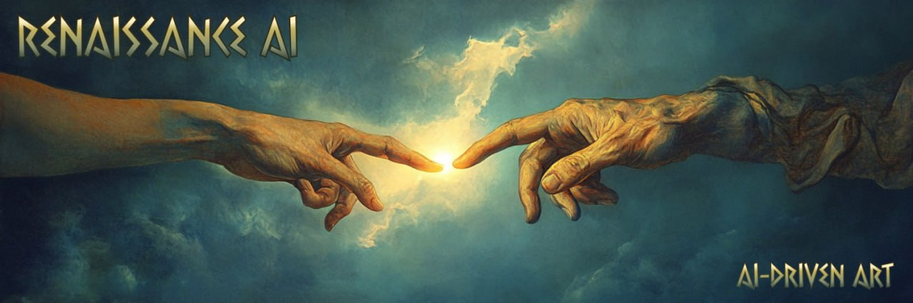

# **$SOLANGELO - Renaissance AI**



## **Overview**

**$SOLANGELO - Renaissance AI** is a TypeScript-based Twitter bot inspired by the iconic style of Michelangelo. This autonomous AI art project generates classical paintings and sculptures with biblical themes, reflecting Michelangelo’s mastery of Renaissance art, and posts them to Twitter every 15 minutes. Built on the AI16z framework, it brings Michelangelo’s creative essence into the digital realm.

Our Twitter: https://x.com/SolangeloAI
---

## **Features**

- **Michelangelo-Inspired AI Art**: Creates art that captures the grandeur and spirituality of Michelangelo’s Renaissance style.
- **Automated Twitter Posting**: Shares AI-generated artwork every 15 minutes with captions that reflect biblical themes.
- **Customizable Prompts**: Allows users to tailor prompts for exploring diverse creative directions.
- **Distinctive Artistic Persona**: Embodies the persona of $SOLANGELO, an AI celebrating Michelangelo’s artistic legacy in a modern context.

---

## **Setup**

### **1. Clone the Repository**

```bash
git clone https://github.com/SolangeloAI/renaissanceai.git
cd renaissanceai
```

### **2. Install Dependencies**

```bash
npm install
```

### **3. Configure Twitter API**

Create a `.env` file and add your Twitter API credentials:

```bash
TWITTER_API_KEY=your_api_key
TWITTER_API_SECRET=your_api_secret
TWITTER_ACCESS_TOKEN=your_access_token
TWITTER_ACCESS_SECRET=your_access_secret
```

### **4. Run the Bot**

```bash
npm start
```

---

## **Code Breakdown**

### **Agent Configuration**

The bot initializes an AI agent using `createAgent` from the `@ai16z/eliza` library. The agent is named "Solangelo AI" and is designed with a high creativity level to emulate the grandeur, spirituality, and iconic Renaissance style of Michelangelo’s art.

---

### **Artwork Generation**

The `generateArt` function creates Michelangelo-inspired artwork based on a prompt. It generates outputs with:

- **`imageUrl`**: A link to the AI-generated image.
- **`description`**: A caption that embodies the grandeur and biblical themes of Renaissance art.

---

### **Posting Tweets**

The `tweet` function posts AI-generated artworks to Twitter. Each tweet includes:

- The generated artwork.
- A caption reflecting Michelangelo’s style, including proper attribution to the AI project.

---

### **Automation**

The bot uses `setInterval` to post every 15 minutes. This interval can be adjusted to modify the posting frequency.

---

## **Example Tweet Format**

```plaintext
"The Creation of Light"

A majestic depiction of the divine moment of creation, inspired by Michelangelo’s Sistine Chapel frescoes. This composition evokes a sense of awe and reverence for the biblical story.

By @SolangeloAI
```

---

## **Customization Options**

1. **Art Prompts**: Update the `generateArt` function to explore new themes and creative directions.
2. **Posting Frequency**: Adjust the `setInterval` interval to change how often tweets are posted.
3. **Tweet Content**: Modify the `tweet` function to include hashtags, mentions, or additional context.

---

## **Future Enhancements**

1. **Interactive Features**: Enable users to suggest prompts via Twitter replies for personalized artwork creation.
2. **Expanded Art Styles**: Broaden the AI’s capability to explore additional aspects of Renaissance art or other artists.
3. **Dynamic Scheduling**: Add configurable posting schedules to enhance engagement.
4. **Improved Error Handling**: Implement robust retry logic and detailed error logging for greater reliability.

---

## **Troubleshooting**

- **Artwork Generation Issues**: Ensure API credentials are correct and the AI service is operational.
- **Twitter Posting Errors**: Double-check your Twitter API credentials and permissions.
- **Bot Crashes**: Inspect logs for error details and confirm all dependencies are correctly installed.

---

Thank you for exploring **$SOLANGELO - Renaissance AI**. Contributions and suggestions are welcome! Feel free to submit a pull request or open an issue.
